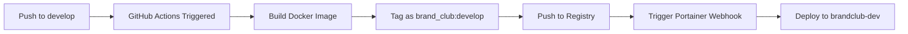

# Brand Club - Production Multi-Environment Deployment

Production-grade Docker Swarm deployment for Brand Club Frappe application with automated CI/CD, multi-environment isolation, and comprehensive backup strategy.

## 📋 Table of Contents

1. [Architecture Overview](#architecture-overview)
2. [VPS Requirements](#vps-requirements)
3. [DNS Configuration](#dns-configuration)
4. [Initial Setup](#initial-setup)
5. [GitHub Configuration](#github-configuration)
6. [Docker Registry Setup](#docker-registry-setup)
7. [CI/CD Pipeline](#cicd-pipeline)
8. [Environment Variables](#environment-variables)
9. [Manual Deployment](#manual-deployment)
10. [Backup & Restore](#backup--restore)
11. [Scaling & Performance](#scaling--performance)
12. [Security & Maintenance](#security--maintenance)
13. [Troubleshooting](#troubleshooting)

---

## 🏗️ Architecture Overview

### Environment Strategy

| Environment | Branch | Stack Name | Purpose | Backup |
|------------|--------|------------|---------|--------|
| **Development** | `develop` | `brandclub-dev` | Active development & testing | No |
| **Staging** | `staging` | `brandclub-staging` | Pre-production testing | No |
| **Production** | `main` | `brandclub-prod` | Live production | Daily |

### Architecture Decisions

**1. Image Tagging Strategy**
- Images are tagged with branch name: `brand_club:develop`, `brand_club:staging`, `brand_club:main`
- Ensures environment isolation at the image level
- Simple rollback: just redeploy previous stack version

**2. Network Isolation**
- Each environment has dedicated overlay networks:
  - `brandclub-dev-network` (backend services)
  - `brandclub-dev-mariadb` (database isolation)
  - Shared: `traefik-public` (ingress), `shared-services` (future mail relay)

**3. Volume Strategy**
- Environment-specific volumes prevent data cross-contamination:
  - `brandclub-dev-sites`, `brandclub-dev-db`, `brandclub-dev-logs`, `brandclub-dev-redis-cache`, `brandclub-dev-redis-queue`
  - Separate volumes for staging and production

**4. Database Stack Separation**
- **Critical**: Database services deployed in separate stacks from applications
- Database stacks: `brandclub-db-dev`, `brandclub-db-staging`, `brandclub-db-prod`
- Contains: MariaDB 10.6, Redis Cache (6.2-alpine), Redis Queue (6.2-alpine)
- Benefits:
  - Zero database downtime during application updates
  - Application stack redeployment doesn't restart databases
  - Clear separation of data layer from application layer
  - Database volumes owned by dedicated stack
- See [DATABASE_MANAGEMENT.md](docs/DATABASE_MANAGEMENT.md) for details

**5. Application Service Composition**
- Each application stack contains:
  - Backend workers (default, short, long queues)
  - Frontend (Nginx with custom templates)
  - WebSocket server
  - Scheduler (singleton)
  - Backup service (production only)
- Connects to database stack via external networks:
  - `brandclub-{env}-network` (general communication)
  - `brandclub-{env}-mariadb` (database access)

**6. Shared Services Architecture**
- `shared-services` overlay network (attachable) for future services:
  - SMTP relay (planned)
  - Monitoring agents
  - Log aggregation
- Services join via `external: true` network declaration

---

## 💻 VPS Requirements

### Minimum Specifications

**Development Environment**
- 2 vCPU
- 4 GB RAM
- 40 GB SSD

**Per Environment (if separate VPS)**
- 2 vCPU
- 4 GB RAM
- 50 GB SSD

**Production (recommended)**
- 4 vCPU
- 8 GB RAM
- 100 GB SSD
- Automatic backups enabled

**All Environments Combined (single VPS)**
- 6 vCPU
- 16 GB RAM
- 200 GB SSD

### Software Requirements

```bash
# Ubuntu 22.04 LTS (recommended) or Debian 11+
Docker Engine: 24.0+
Docker Compose: 2.20+
Git: 2.30+
```

### Required Ports

| Port | Service | Public/Internal |
|------|---------|-----------------|
| 80 | HTTP (Traefik) | Public |
| 443 | HTTPS (Traefik) | Public |
| 9000 | Portainer (optional) | Public |
| 8080 | Traefik Dashboard | Public (authenticated) |

**Internal Ports (Swarm Overlay)**
- 3306 (MariaDB)
- 6379 (Redis)
- 8000 (Gunicorn)
- 9000 (WebSocket)

---

## 🌐 DNS Configuration

Point these DNS A records to your VPS IP:

### Development
```
dev.brandclub.com          → YOUR_VPS_IP
mailpit.dev.brandclub.com  → YOUR_VPS_IP
```

### Staging
```
staging.brandclub.com      → YOUR_VPS_IP
```

### Production
```
brandclub.com              → YOUR_VPS_IP
www.brandclub.com          → YOUR_VPS_IP (optional)
```

### Infrastructure (Optional)
```
traefik.brandclub.com      → YOUR_VPS_IP
portainer.brandclub.com    → YOUR_VPS_IP
```

**DNS Propagation**: Allow 5-15 minutes for DNS to propagate before running setup.

---

## 🚀 Initial Setup

### 1. Clone Repository

```bash
git clone https://github.com/YOUR_ORG/brand_club.git
cd brand_club
```

### 2. Run Interactive Setup Script

```bash
chmod +x scripts/setup-brandclub.sh
./scripts/setup-brandclub.sh
```

The script will:
1. ✅ Initialize Docker Swarm
2. ✅ Create overlay networks (including `shared-services`)
3. ✅ Deploy Traefik (reverse proxy with Let's Encrypt)
4. ✅ Deploy Portainer (optional, for stack management)
5. ✅ Create environment-specific volumes
6. ✅ Deploy all three stacks (dev, staging, prod)
7. ✅ Create backup directory structure
8. ✅ Generate environment files with secrets

### 3. Verify Deployment

```bash
# Check stacks
docker stack ls

# Check services
docker stack ps brandclub-dev
docker stack ps brandclub-staging
docker stack ps brandclub-prod

# View logs
docker service logs -f brandclub-dev_backend
```

### 4. Create Frappe Sites

**Development**
```bash
# Get container ID
CONTAINER=$(docker ps -q -f name=brandclub-dev_backend)

# Create new site
docker exec -it $CONTAINER bench new-site dev.brandclub.com \
  --admin-password 'ADMIN_PASSWORD' \
  --db-root-password 'DB_ROOT_PASSWORD'

# Install apps (if needed)
docker exec -it $CONTAINER bench --site dev.brandclub.com install-app brand_club

# Set as default site
docker exec -it $CONTAINER bench use dev.brandclub.com
```

Repeat for staging and production with appropriate domain names.

---

## 🐙 GitHub Configuration

### 1. Create GitHub Repository

```bash
# Initialize git (if not already)
git init
git add .
git commit -m "Initial brand_club deployment setup"

# Create remote repository on GitHub
# Then push
git remote add origin https://github.com/YOUR_ORG/brand_club.git
git push -u origin main
```

### 2. Configure Branch Protection

**Settings → Branches → Add Rule**

- **Branch name pattern**: `main`
- ✅ Require pull request before merging
- ✅ Require status checks to pass before merging
- ✅ Do not allow bypassing the above settings

Repeat for `staging` and `develop` branches.

### 3. Create GitHub Secrets

**Settings → Secrets and variables → Actions → New repository secret**

Required secrets:

```bash
# Docker Registry
DOCKER_REGISTRY_URL          # e.g., ghcr.io or docker.io
DOCKER_REGISTRY_USERNAME     # GitHub username or Docker Hub username
DOCKER_REGISTRY_TOKEN        # GitHub PAT or Docker Hub token

# Portainer Webhooks (created in next section)
PORTAINER_WEBHOOK_DEV        # https://portainer.domain.com/api/webhooks/xxx
PORTAINER_WEBHOOK_STAGING    # https://portainer.domain.com/api/webhooks/yyy
PORTAINER_WEBHOOK_PROD       # https://portainer.domain.com/api/webhooks/zzz

# Build Configuration
FRAPPE_VERSION               # e.g., v15.91.3
PYTHON_VERSION               # e.g., 3.12.8
NODE_VERSION                 # e.g., 22.14.0
```

### 4. Create Portainer Webhooks

**In Portainer:**

1. Navigate to **Stacks**
2. Select stack (e.g., `brandclub-dev`)
3. Scroll to **Webhook** section
4. Click **Create webhook**
5. Copy webhook URL
6. Save as GitHub secret `PORTAINER_WEBHOOK_DEV`

Repeat for all three stacks.

**Webhook Format:**
```
https://portainer.yourdomain.com/api/webhooks/<WEBHOOK_ID>
```

When webhook is triggered, Portainer will:
1. Pull the latest image
2. Redeploy the stack
3. Gracefully restart services

---

## 🐳 Docker Registry Setup

### Option 1: GitHub Container Registry (Recommended)

**Free for public repos, free tier for private**

1. Create Personal Access Token (PAT)
   - Settings → Developer settings → Personal access tokens → Tokens (classic)
   - Scopes: `write:packages`, `read:packages`, `delete:packages`

2. Login to GHCR
```bash
echo $GITHUB_TOKEN | docker login ghcr.io -u YOUR_USERNAME --password-stdin
```

3. Update image references in workflows (already configured)
```yaml
image: ghcr.io/YOUR_ORG/brand_club:${BRANCH_NAME}
```

### Option 2: Docker Hub

1. Create Docker Hub account
2. Create repository: `brand_club`
3. Generate access token

```bash
docker login -u YOUR_USERNAME
```

4. Update workflow file:
```yaml
image: YOUR_USERNAME/brand_club:${BRANCH_NAME}
```

### Option 3: Private Registry (Self-hosted)

Deploy registry on your VPS:

```bash
docker service create \
  --name registry \
  --publish 5000:5000 \
  --mount type=volume,source=registry-data,target=/var/lib/registry \
  registry:2
```

Update image references:
```yaml
image: registry.yourdomain.com:5000/brand_club:${BRANCH_NAME}
```

---

## 🔄 CI/CD Pipeline

### How It Works



### Pipeline Stages

**1. Build Stage**
- Checkout code
- Build custom Frappe image with brand_club app
- Uses apps.json for app configuration
- Multi-stage build for optimization

**2. Tag & Push Stage**
- Tags image with branch name
- Pushes to configured registry
- Supports GHCR, Docker Hub, or private registry

**3. Deploy Stage**
- Triggers Portainer webhook
- Portainer pulls new image
- Rolling update of services
- Zero-downtime deployment

### Workflow Files

Located in `.github/workflows/`:
- `deploy-dev.yml` - Triggered on push to `develop`
- `deploy-staging.yml` - Triggered on push to `staging`
- `deploy-prod.yml` - Triggered on push to `main`

### Build Configuration

**`brand_club/ci/apps.json`** - Defines apps to install:
```json
[
  {
    "url": "https://github.com/frappe/erpnext",
    "branch": "version-15"
  },
  {
    "url": "https://github.com/YOUR_ORG/brand_club",
    "branch": "develop"
  }
]
```

**Branch-specific apps**:
- `apps-develop.json` - Development dependencies
- `apps-staging.json` - Staging configuration
- `apps-production.json` - Production-only apps

---

## 🔐 Environment Variables

### Common Variables (All Environments)

```bash
# Image Configuration
IMAGE_NAME=brand_club                    # Base image name
VERSION=develop                          # Branch tag (auto-set by CI)

# Site Configuration
SITES=dev.brandclub.com                  # Comma-separated site list
FRAPPE_SITE_NAME_HEADER=$$host          # Site resolution header

# Networking
CLIENT_MAX_BODY_SIZE=50m                 # Max upload size
BACKEND=backend:8000                     # Gunicorn backend
SOCKETIO=websocket:9000                  # WebSocket endpoint

# Redis
REDIS_CACHE=redis-cache:6379
REDIS_QUEUE=redis-queue:6379

# MariaDB
DB_HOST=db                               # Service name
DB_PORT=3306
MYSQL_ROOT_PASSWORD_FILE=/run/secrets/db_root_password
```

### Development-Specific

```bash
MAILPIT_HOST=mailpit.dev.brandclub.com
DEVELOPER_MODE=1                         # Enable bench developer mode
FRAPPE_LOGGING_LEVEL=DEBUG
```

### Production-Specific

```bash
# Backup Configuration
BACKUP_DIR=/backups/brandclub.com
BACKUP_RETENTION_DAYS=7

# Performance
GUNICORN_WORKERS=4                       # Auto: (2 * CPU) + 1
WORKER_REPLICAS=2                        # Scale background workers

# Security
DISABLE_FRAPPE_DESK=0                    # Keep desk enabled
ADMIN_PASSWORD_FILE=/run/secrets/admin_password
```

### Secrets Management

Using Docker Swarm secrets:

```bash
# Create secrets
echo "STRONG_DB_PASSWORD" | docker secret create brandclub_prod_db_password -
echo "STRONG_ADMIN_PASSWORD" | docker secret create brandclub_prod_admin_password -

# Reference in compose
secrets:
  db_root_password:
    external: true
    name: brandclub_prod_db_password
```

---

## 🎯 Manual Deployment

### Deployment Order

**Critical**: Database stacks must be deployed BEFORE application stacks.

```bash
# 1. Deploy infrastructure
docker stack deploy -c stacks/traefik.yml traefik
docker stack deploy -c stacks/portainer.yml portainer

# 2. Deploy database stacks (these create networks)
docker stack deploy -c brand_club/stacks/database-dev.yml brandclub-db-dev
docker stack deploy -c brand_club/stacks/database-staging.yml brandclub-db-staging
docker stack deploy -c brand_club/stacks/database-prod.yml brandclub-db-prod

# 3. Wait for databases to be ready
sleep 30

# 4. Deploy application stacks
docker stack deploy -c brand_club/stacks/brandclub-dev.yml brandclub-dev
docker stack deploy -c brand_club/stacks/brandclub-staging.yml brandclub-staging
docker stack deploy -c brand_club/stacks/brandclub-prod.yml brandclub-prod
```

**Why This Order?**
- Database stacks create and own overlay networks (`brandclub-{env}-network`, `brandclub-{env}-mariadb`)
- Application stacks reference these networks as `external: true`
- Deploying app stacks first will fail with "network not found" errors
- See [DATABASE_MANAGEMENT.md](docs/DATABASE_MANAGEMENT.md) for details

### Deploy Specific Stack

```bash
# Database stacks (deploy first)
docker stack deploy -c brand_club/stacks/database-dev.yml brandclub-db-dev
docker stack deploy -c brand_club/stacks/database-staging.yml brandclub-db-staging
docker stack deploy -c brand_club/stacks/database-prod.yml brandclub-db-prod

# Application stacks (deploy after databases)
docker stack deploy -c brand_club/stacks/brandclub-dev.yml brandclub-dev
docker stack deploy -c brand_club/stacks/brandclub-staging.yml brandclub-staging
docker stack deploy -c brand_club/stacks/brandclub-prod.yml brandclub-prod
```

### Update Stack (Pull Latest Image)

```bash
# Option 1: Via Portainer webhook
curl -X POST https://portainer.yourdomain.com/api/webhooks/YOUR_WEBHOOK_ID

# Option 2: Manual redeploy
docker service update --image ghcr.io/YOUR_ORG/brand_club:main \
  brandclub-prod_backend \
  brandclub-prod_frontend \
  brandclub-prod_queue-default \
  brandclub-prod_queue-short \
  brandclub-prod_queue-long \
  brandclub-prod_scheduler \
  brandclub-prod_websocket
```

### Rollback Deployment

```bash
# Rollback to previous version
docker service rollback brandclub-prod_backend

# Or specify image tag
docker service update --image ghcr.io/YOUR_ORG/brand_club:v1.2.3 \
  brandclub-prod_backend
```

---

## 💾 Backup & Restore

### Automated Backups (Production)

**Backup service runs daily at 2 AM UTC**

- Uses `brandclub-backup` service in prod stack
- Executes `bench backup` for all sites
- Stores in `/backups/brandclub.com/YYYY-MM-DD/`
- Auto-cleanup: deletes backups older than 7 days

**Backup Contents:**
```
/backups/brandclub.com/
├── 2026-02-20/
│   ├── database.sql.gz              # MariaDB dump
│   ├── files.tar                    # Uploaded files
│   └── private-files.tar            # Private files
├── 2026-02-19/
└── 2026-02-18/
```

### Manual Backup

```bash
# Get backend container
CONTAINER=$(docker ps -q -f name=brandclub-prod_backend)

# Create backup
docker exec -it $CONTAINER bench --site brandclub.com backup \
  --with-files

# Download backup
docker cp $CONTAINER:/home/frappe/frappe-bench/sites/brandclub.com/private/backups/ \
  ./local-backups/
```

### Restore Backup

**1. Stop services (optional, for safety)**
```bash
docker service scale brandclub-prod_backend=0
docker service scale brandclub-prod_queue-default=0
docker service scale brandclub-prod_queue-short=0
docker service scale brandclub-prod_queue-long=0
```

**2. Copy backup files to container**
```bash
CONTAINER=$(docker ps -q -f name=brandclub-prod_backend)

docker cp ./backups/2026-02-20/ \
  $CONTAINER:/home/frappe/frappe-bench/sites/brandclub.com/private/backups/
```

**3. Restore**
```bash
# Restore database
docker exec -it $CONTAINER bench --site brandclub.com \
  restore /home/frappe/frappe-bench/sites/brandclub.com/private/backups/2026-02-20/database.sql.gz

# Restore files
docker exec -it $CONTAINER bench --site brandclub.com \
  restore --with-files \
  /home/frappe/frappe-bench/sites/brandclub.com/private/backups/2026-02-20/
```

**4. Restart services**
```bash
docker service scale brandclub-prod_backend=1
docker service scale brandclub-prod_queue-default=1
docker service scale brandclub-prod_queue-short=1
docker service scale brandclub-prod_queue-long=1
```

### Off-site Backup (Recommended)

**Option 1: rsync to remote server**
```bash
# Add to crontab
0 4 * * * rsync -avz /backups/ backup-server:/remote/backups/
```

**Option 2: S3/Object Storage**
```bash
# Install s3cmd or AWS CLI
docker exec brandclub-backup s3cmd sync /backups/ s3://your-bucket/backups/
```

---

## 📊 Scaling & Performance

### Horizontal Scaling

**Scale background workers:**
```bash
# Scale queue workers
docker service scale brandclub-prod_queue-default=3
docker service scale brandclub-prod_queue-long=2
docker service scale brandclub-prod_queue-short=2

# Scale backend (Gunicorn)
docker service scale brandclub-prod_backend=2
```

**Update in compose file:**
```yaml
queue-default:
  deploy:
    replicas: 3  # Increase from 1
```

### Vertical Scaling

**Increase resource limits:**
```yaml
backend:
  deploy:
    resources:
      limits:
        cpus: '2.0'
        memory: 2G
      reservations:
        cpus: '1.0'
        memory: 1G
```

### Performance Tuning

**Gunicorn workers (backend service):**
```bash
# Environment variable
GUNICORN_WORKERS=4  # Formula: (2 * num_cores) + 1
GUNICORN_TIMEOUT=120
```

**MariaDB optimization:**
```yaml
command:
  - --max-connections=500
  - --innodb-buffer-pool-size=2G
  - --innodb-log-file-size=512M
  - --query-cache-size=0
  - --query-cache-type=0
```

**Redis optimization:**
```yaml
command:
  - redis-server
  - --maxmemory 512mb
  - --maxmemory-policy allkeys-lru
```

### Monitoring

**Basic monitoring:**
```bash
# Service resource usage
docker stats

# Service status
docker service ls

# Logs
docker service logs -f --tail 100 brandclub-prod_backend
```

**Advanced monitoring (recommended):**
- Deploy Prometheus + Grafana stack
- Use `frappe-bench` built-in monitoring
- Integrate with external APM (New Relic, Datadog)

---

## 🔒 Security & Maintenance

### Rotate MariaDB Password

**1. Update password in database**
```bash
CONTAINER=$(docker ps -q -f name=brandclub-prod_db)

docker exec -it $CONTAINER mysql -u root -p
```
```sql
ALTER USER 'root'@'%' IDENTIFIED BY 'NEW_STRONG_PASSWORD';
ALTER USER 'root'@'localhost' IDENTIFIED BY 'NEW_STRONG_PASSWORD';
FLUSH PRIVILEGES;
EXIT;
```

**2. Update Docker secret**
```bash
# Create new secret with version
echo "NEW_STRONG_PASSWORD" | docker secret create brandclub_prod_db_password_v2 -

# Update service to use new secret
# Edit brandclub-prod.yml to reference new secret
docker stack deploy -c brand_club/stacks/brandclub-prod.yml brandclub-prod

# Remove old secret (after verification)
docker secret rm brandclub_prod_db_password
```

### SSL Certificate Renewal

**Automatic (Let's Encrypt via Traefik):**
- Certificates auto-renew 30 days before expiry
- No manual intervention needed

**Manual force renewal:**
```bash
# Restart Traefik
docker service update --force traefik_traefik
```

### Update Frappe/Apps

**1. Update apps.json**
```bash
# Update version in brand_club/ci/apps-production.json
# Commit and push to main branch
```

**2. Trigger rebuild**
```bash
# Push to main will trigger CI/CD
git push origin main

# Or manually rebuild
docker build -t ghcr.io/YOUR_ORG/brand_club:main \
  -f brand_club/Dockerfile .
docker push ghcr.io/YOUR_ORG/brand_club:main
```

**3. Run migrate**
```bash
CONTAINER=$(docker ps -q -f name=brandclub-prod_backend)
docker exec -it $CONTAINER bench --site brandclub.com migrate
```

### System Maintenance

**Weekly:**
- Check disk space: `df -h`
- Review logs for errors
- Verify backups: `ls -lh /backups/brandclub.com/`

**Monthly:**
- Update Docker: `apt update && apt upgrade docker-ce`
- Review resource usage: `docker stats`
- Test restore procedure

**Quarterly:**
- Security audit
- Performance review
- Update base images

---

## 🔧 Troubleshooting

### Service Won't Start

**Check service status:**
```bash
docker service ps brandclub-prod_backend --no-trunc
```

**View logs:**
```bash
docker service logs -f brandclub-prod_backend
```

**Common issues:**
- Secrets not created: Create required secrets
- Network not found: Deploy networks first
- Volume permission: Check file permissions

### Database Connection Refused

**Check database service:**
```bash
docker service ps brandclub-prod_db
docker service logs brandclub-prod_db
```

**Test connection:**
```bash
CONTAINER=$(docker ps -q -f name=brandclub-prod_backend)
docker exec -it $CONTAINER ping db
docker exec -it $CONTAINER nc -zv db 3306
```

### Site Not Loading

**Check Traefik routing:**
```bash
docker service logs traefik_traefik | grep brandclub
```

**Verify DNS:**
```bash
nslookup brandclub.com
```

**Check service labels:**
```bash
docker service inspect brandclub-prod_frontend | grep traefik
```

### Slow Performance

**Check resource usage:**
```bash
docker stats

# Check specific service
docker stats $(docker ps -q -f name=brandclub-prod_backend)
```

**Database slow queries:**
```bash
CONTAINER=$(docker ps -q -f name=brandclub-prod_db)
docker exec -it $CONTAINER mysql -u root -p
```
```sql
SHOW PROCESSLIST;
SELECT * FROM information_schema.INNODB_TRX;
```

### Backup Service Failing

**Check backup service logs:**
```bash
docker service logs brandclub-prod_backup
```

**Test manual backup:**
```bash
CONTAINER=$(docker ps -q -f name=brandclub-prod_backend)
docker exec -it $CONTAINER bench --site brandclub.com backup
```

**Check disk space:**
```bash
df -h /backups/
```

---

## 📞 Support & Resources

### Official Documentation

- [Frappe Docker](https://github.com/frappe/frappe_docker)
- [Docker Swarm](https://docs.docker.com/engine/swarm/)
- [Traefik](https://doc.traefik.io/traefik/)
- [Portainer](https://docs.portainer.io/)

### Community

- [Frappe Forum](https://discuss.frappe.io/)
- [Discord](https://frappe.io/discord)

### Useful Commands Cheat Sheet

```bash
# Stack Management
docker stack ls
docker stack ps brandclub-prod
docker stack rm brandclub-prod

# Service Management
docker service ls
docker service logs -f <service>
docker service scale <service>=<count>
docker service update --force <service>

# Network
docker network ls
docker network inspect brandclub-prod-network

# Secrets
docker secret ls
docker secret create <name> <file>
docker secret rm <name>

# Volumes
docker volume ls
docker volume inspect <name>
docker volume rm <name>

# Swarm
docker node ls
docker swarm leave --force
```

---

## 📝 License

[Your License]

## 🤝 Contributing

[Your Contributing Guidelines]

---

**Last Updated:** February 2026
**Version:** 1.0.0
**Maintainer:** Your Team
